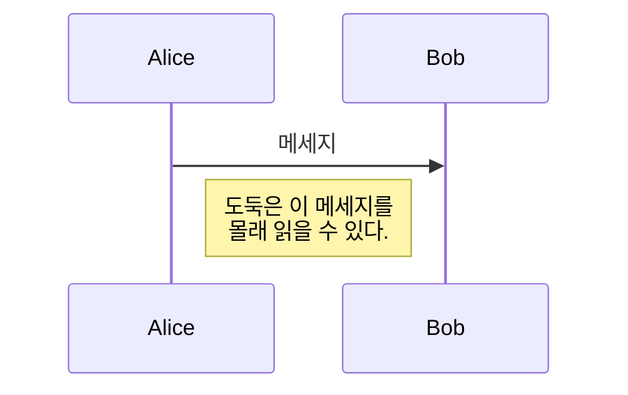
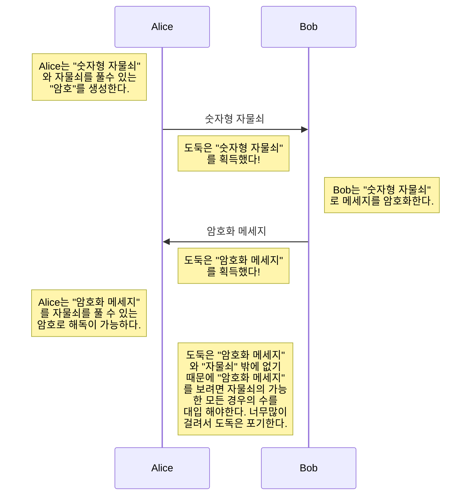

# RSA encryption
- RSA encryption 이란?
- 자물쇠와 비밀번호
- 모듈러 연산
- 오일러의 정리(Euler's theory)
- 소인수 분해 vs 곱의 시간 복잡도
- 오일러 피 함수

## RSA Encryption 이란?
RSA 암호화는 현대의 컴퓨터들이 메세지를 암호화 복호화할때 쓰이는 알고리즘이다. Rivest, Shamir, Adleman 에 의해서 만들어졌으며 현대 가장 많이 쓰이는 암호화 방식중 하나이다.

## 자물쇠와 비밀번호
RSA람 무엇인가? 를 이해하기 위해서는 자물쇠와 비밀번호라는 개념을 이해해야한다. 예를 들어 우리가 메세지를 보내고 싶어한다고 생각해보자 하지만 중간에 메세지를 다른 사람이 갈취해 갈 수 있다.

그래서 우리는 도둑이 이 메세지를 읽을 수 없도록 숫자형 자물쇠를 이용할 것이다!!

숫자형 자물쇠는 자물쇠를 잠그기는 쉽지만 자물쇠를 풀려면 가능한 모든수를 대입해야하므로 암호화는 쉽지만 복호화(암호화된 정보를 다시 원본 정보로 돌리는 행위)하기 어렵다고 할 수 있다.

그럼 어떻게 숫자형 자물쇠로 Alice는 Bob에세 메세지를 안전하게 보낼 수 있을까?

위 과정을 통해서 Alice는 Bob에세 메세지를 안전하게 받을 수 있고 Bob은 거꾸로만 하면 메세지를 안전하게 받을 수 있다.

이것이 가능한 이유는 바로 열쇠형 자물쇠가 잠굴때는 간편하고 (비밀번호를 몰라도 누구나 잠굴 수 있으니까) 풀때는(모든 가능한 비밀번호를 다 시도해봐야하므로..) 복잡하지만 "비밀번호"를 알기만 하면 바로 풀수 있다.

이를 우리는 One-way function 즉 한쪽방향으로는 쉬운 다른쪽 방향으로는 어려운 함수라고 한다.  여기에 "비밀번호"는 One-way function의 어려운 방향을 한번에 깨게 해줄 수 있는 Backdoor그러니까 뒷문이라고 한다.

RSA Encryption이란 One-way function으로 만들어진 즉 자물쇠와 그에 대응하는 비밀번호만드는 특정 기법을 뜻한다.

## 모듈러 연산

정수 a가 있을때 우리는 이것의 m 으로 나눴을때의 나머지를 r이라하면
$$a = qm + r$$
이다. 이때 q는 임의의 정수로 몫이다. 이때 r은 나머지이다. 하지만 수학자들은 이렇게 쓰는 것이 귀찮아서 다른방법을 만들었는데 그것이 바로 모듈러 연산이다.
$$
a ≡ r  \pmod m
$$
이때 우리는 "a와 r은 모듈러 m 합동이다" 라고 한다.
우리는 일상생활 속에 아주 많은 모듈러 연산을 당연스럽게 사용하는데 그중 가장 대표적으로 시계가  있다. 우리는 20시라고 말하면 아주 자연스럽게
$$20 ≡ 8 \pmod {12}$$
를 머리속으로 계산하여 8시라고 당연하게 인식한다.

여기서 아주 생뚱맞게 모듈러 연산의 한 특징을 알아보자
$$
\begin{aligned}
if \quad a ≡ b& \quad and \quad m ≡ m \\
then \quad a*m& ≡ b*m
\end{aligned}
$$
은 성립한다.
$$
\begin{aligned}
a &= kd + b \\
a' &= k'd + b' \\
이렇게 &두 수가 있다. \\
aa'& = (kd+b)(k'd+b') = kk'd^2 + kdb' + k'bd + bb' \\
aa' &= kk'd^2 + kdb' + k'bd + bb' \\
aa' - bb'& = kk'd^2 + kdb' + k'bd \\
&= (kk'd + kb' + kb) \\
&= t \\
aa' - bb' &= td \\
aa' &\equiv bb' \pmod d
\end{aligned}
$$
이렇기 때문이다.

## 오일러의 정리(Euler's theory)

여기서 왜 RSA Encryption을 하는데 모듈러 연상을 왜 배웠을까? 그것은 바로 여기서부터 말도 안되는 정리를 쓸것이기 때문이다... 그것은 바로 **오일러의 정리**이다.

$$
a^{\varphi(N)} ≡ 1 \pmod N
$$

`
`
`
`
`
`
`
`
`
`
`
`
`
`
`
`
`
`
`
`
`
`
`
`
`
`
`
`
`
`
`
`
`
`
`
`

Euler's Theorm
$$
a^{\varphi(n)} = 1 ( mod n )
$$

$$
\prod_{i=1}^{\infty}
$$

$$
\Gamma(z) = \int_0^\infty t^{z-1}e^{-t}dt\,.
$$

하는 두 개의 서로 다른 ()  [소수](https://ko.wikipedia.org/wiki/%EC%86%8C%EC%88%98_(%EC%88%98%EB%A1%A0) "소수 (수론)")를 고른다.

1.  두 수를 곱하여    을 찾는다.
2.  

