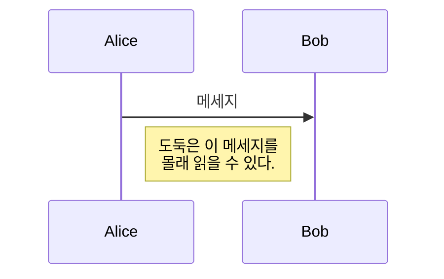
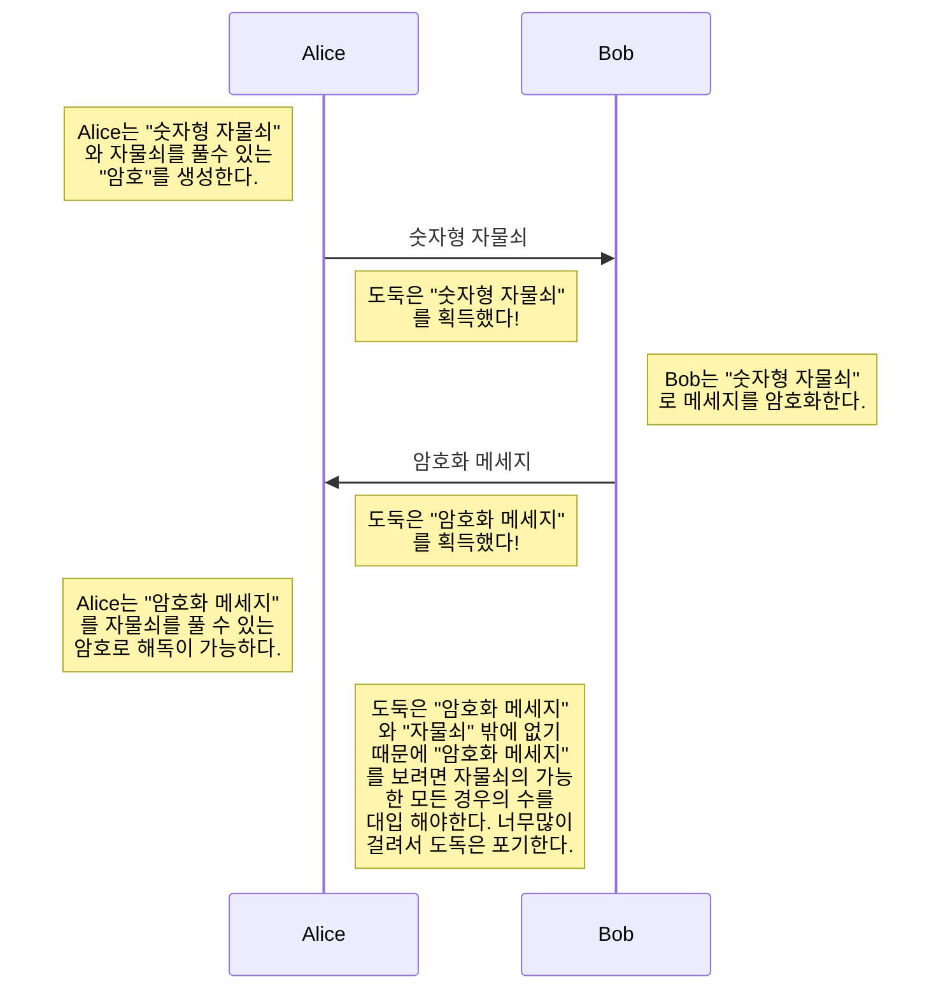

 
# RSA encryption
- RSA encryption 이란?
- 자물쇠와 비밀번호
- 오일러 피 함수(Euler's Phi function)
- 모듈러 연산
- 오일러의 정리(Euler's theory)

## RSA Encryption 이란?
RSA 암호화는 현대의 컴퓨터들이 메세지를 암호화 복호화할때 쓰이는 알고리즘이다. Rivest, Shamir, Adleman 에 의해서 만들어졌으며 현대 가장 많이 쓰이는 암호화 방식중 하나이다.

## 자물쇠와 비밀번호
RSA람 무엇인가? 를 이해하기 위해서는 자물쇠와 비밀번호라는 개념을 이해해야한다. 예를 들어 우리가 메세지를 보내고 싶어한다고 생각해보자 하지만 중간에 메세지를 다른 사람이 갈취해 갈 수 있다.

그래서 우리는 도둑이 이 메세지를 읽을 수 없도록 숫자형 자물쇠를 이용할 것이다!!

숫자형 자물쇠는 자물쇠를 잠그기는 쉽지만 자물쇠를 풀려면 가능한 모든수를 대입해야하므로 암호화는 쉽지만 복호화(암호화된 정보를 다시 원본 정보로 돌리는 행위)하기 어렵다고 할 수 있다.

그럼 어떻게 숫자형 자물쇠로 Alice는 Bob에세 메세지를 안전하게 보낼 수 있을까?

위 과정을 통해서 Alice는 Bob에세 메세지를 안전하게 받을 수 있고 Bob은 거꾸로만 하면 메세지를 안전하게 받을 수 있다.

이것이 가능한 이유는 바로 열쇠형 자물쇠가 잠굴때는 간편하고 (비밀번호를 몰라도 누구나 잠굴 수 있으니까) 풀때는(모든 가능한 비밀번호를 다 시도해봐야하므로..) 복잡하지만 "비밀번호"를 알기만 하면 바로 풀수 있다.

이를 우리는 One-way function 즉 한쪽방향으로는 쉬운 다른쪽 방향으로는 어려운 함수라고 한다.  여기에 "비밀번호"는 One-way function의 어려운 방향을 한번에 깨게 해줄 수 있는 Backdoor(뒷문) 이라고 한다.

**RSA Encryption이란** **Backdoor을 가진 One-way function**으로 만들어진 **암호화 기법이다.**

## 오일러 피 함수(Euler's phi function)
이것이 **오일러 피 함수**이다. 
$$
\varphi(n) = (1\text{\textasciitilde}n까지의\; 정수가운데\; n과\; 서로소인\; 것들의\; 개수)
$$
이렇게만 보면 대체 뭔소리를 하는지 모르겠다. 대체 왜 오일러 피 함수뭐고 왜 튀어나오는 것일까?? 천천히 오일러 피 함수에 대해서 알아보자

**서로소**란 두수의 gcd즉 최대공약수가 1인 수를 뜻한다.
고로 만약에 ϕ(8) 을 구한다 1~8사이 정수중 8과 서로소인 수는
**gcd(1,8) = 1**
gcd(2,8) = 2
**gcd(3,8) = 1**
gcd(4,8) = 4
**gcd(5,8) = 1**
gcd(6,8) = 2
**gcd(7,8) = 1**
gcd(8,8) = 8
$$
\varphi(n) = 4
$$
인것을 알 수 있다.

그런데 여기서 우리는 오일러 피 함수의 신기한 특성을 알 수 있다. 한번 오일러 피 함수에 소수를 넣어보자!!
ϕ(11)을 구해보면 1~11사이 정수중 11과 서로소인 수는
**gcd(1,11) = 1
gcd(2,11) = 1
gcd(3,11) = 1
gcd(4,11) = 1
gcd(5,11) = 1
gcd(6,11) = 1
gcd(7,11) = 1
gcd(8,11) = 1
gcd(9,11) = 1
gcd(10,11) = 1**
gcd(11,11) = 11
고로 우리는 잘 생각해보면 소수는 자기자신과 1빼고 약수가 없으므로 오일러 피 함수는 아래의 특징을 가진다고 할 수 있다.
$$
\tag{if p is prime}  \varphi(p) = p-1
$$

여기에서 오일러 피 함수의이상한 특징을 한개 알아보자 오일러 피 함수는 특정 조건에서 **곱셈적 함수**이다. 이게 무슨 뜻이냐면
$$
\tag{m,n은 서로소 일때} \varphi(mn) = \varphi(m) * \varphi(n) 
$$
이것의 증명은 너무 머리 아프므로 추후에 정리하겠다.

방금 우리는 Backdoor을 가진 One-way function를 만들 수 있는 방법에 대해서 배웠다.
맞다 지금까지 배운 **오일러 피 함수**는 One-way function 만들수 있는 재료이다!

그럼 지금부터 만들어보겠다.

$$
\begin{aligned}
N &= pq \\
\tag{p != q and p,q is prime} \varphi(N) &= \varphi(p) * \varphi(q) \\
\varphi(pq) &= \varphi(p) * \varphi(q) \\
\varphi(pq) &= (p-1)(q-1)
\end{aligned}
$$

막상 써놓고보니 이해가 전혀 되지 않는다. 그럼 찬찬히 살펴보자

예를 들어 ϕ(N)을 구한다고 해보다 그럼 1~N까지 각각의 숫자a 에 gcd(a,N)=1인지 확인해야한다. 그럼 
gcd 알고리즘은 O(log(n+m))의 시간복잡도이고 N번 시행해야하니까 O(N log(n+m) ) 즉 엄청나게 큰 N에서는 어마어마하게 많이 걸린다고 보면 된다... 

그럼 다른 방법으로 접근해보자! 음 N은 합성수니까 소인수분해를 해서 소수를 알면 한번에 구해지겠지! 라는 마음가짐으로 소수를 보면 소인수분해는 음... 
N = 11438162575788867669265779976146612010218296672124236256256184
293570693524573389783059712356395870505898907514899290026879
이라는 숫자 옛날 RSA암호에 쓰인 값 이었는데 이 값을 소인수분해 하려고 무려 1993년 8월 1600대의 컴퓨터를 동원해 8개월이 걸렸다... 실제로는 100자리 이상의 숫자를 쓰는데 이는 우주의 태어나고 사라질때까지 계산해도 계산이 끝나지 않는다..

그렇다 이게 바로 One-way function 이다. 
우리는 p와 q를 가지고 아주 쉽게 N을 만들수 있다. 곱하기는 쉽기 때문이다.
하지만 p와 q를 모른채 ϕ(N)을 구한다하면 충분히 큰 N값은 못구한다고 보장할 수 있다. 하지만 p, q를 알면 바로 구할 수 있다.

자물쇠를 잠그는 행위 : N = p*q
자물쇠를 무차별 대입으로 푸는 행위 : 소인수분해
자물쇠를 풀 열쇠 : p, q

정확히 열쇠가 아니지만 

## 모듈러 연산

정수 a가 있을때 우리는 이것의 m 으로 나눴을때의 나머지를 r이라하면
$$a = qm + r$$
이다. 이때 q는 임의의 정수로 몫이다. 이때 r은 나머지이다. 하지만 수학자들은 이렇게 쓰는 것이 귀찮아서 다른방법을 만들었는데 그것이 바로 모듈러 연산이다.
$$
a ≡ r  \pmod m
$$
이때 우리는 "a와 r은 모듈러 m 합동이다" 라고 한다.
우리는 일상생활 속에 아주 많은 모듈러 연산을 당연스럽게 사용하는데 그중 가장 대표적으로 시계가  있다. 우리는 20시라고 말하면 아주 자연스럽게
$$20 ≡ 8 \pmod {12}$$
를 머리속으로 계산하여 8시라고 당연하게 인식한다.

여기서 아주 생뚱맞게 모듈러 연산의 한 특징을 알아보자
$$
\begin{aligned}
\\
if& \quad a ≡ b \pmod{N} \quad and \quad n = n \\
then& \quad a*n ≡ b*n \pmod {N}\\
\\
위가\; 성립한다는\; 것은 \; &아래\; 식을\; 보면\; 알\; 수\; 있다.  \\
\\
\end{aligned}
$$
$$
\begin{aligned}
아래는\; 우리가\; 잘\; 알고있는\; &두수\; a와\; b\; 그리고\; a'와\; b'\;는\; 모듈러\; m\; 합동이다 \\
\\
a &\equiv b \pmod m\\
a' &\equiv b' \pmod m \\
\\
위를\; 아래와\; 같이\; 바꾸었다고\; &생각하면\; k\; 는\; 아무\; 정수가\; 될수\; 있고\; m은\; 고정된다.
\\
\\
a &= km + b \\
a' &= k'm + b' \\
\\
a와\; a'&를\; 서로\; 곱하면 \\
\\
aa'& = (km+b)(k'm+b')\\
aa' &= kk'm^2 + kmb' + k'bm + bb' \\
\\
여기서\; bb'\; &이항을\; 하고\; m\; 동류항으로\; 정리를\; 한다. \\
\\
aa' - bb' &= kk'm^2 + kmb' + k'bm \\
aa' - bb' &= (kk'm + kb' + kb)m \\
\\
여기에서\; &bb'를\; 다시\; 이항하면 \\ 
\\
aa' &= (kk'm + kb' + kb)m + bb' \\
aa' &= tm + bb' \\
\\
이는\; 다시\; "aa'와\; &bb'은\; 모듈러\; m\; 합동이다"\; 라고\; 쓸\; 수\; 있다. \\
\\
aa' &\equiv bb' \pmod d \\
\end{aligned}
$$

## 오일러의 정리(Euler's theory)

앞에서 배운 **오일러 피 함수**즉 One-way function을 이용해서 메세지(이제부터 메세지를 특정 정수 m 이라고 하겠다.) m을 암호화(자물쇠로 잠궈버려) 시켜야한다. 그럼 대체 어떻게 m을 ϕ(N)식과 묶을수 있을까? 그것은 바로 **오일러의 정리**이다.
$$
\tag{m,N은 서로소여야 한다.} m^{\varphi(N)} ≡ 1 \pmod N
$$
이 정리가 있다면 **메세지(m)**과 **오일러 피 함수**를 묶어서 오일러 피 함수의 값을 알아야지만 m 을 역순으로 돌릴 수 있으면 

$$
\begin{aligned}
\tag{m,N은 서로소여야 한다.} m^{\varphi(N)} &≡ 1 \pmod N \\
m^{k*\varphi(N)} &≡ 1^k \pmod N \\
m^{k*\varphi(N)} &≡ 1 \pmod N \\
m^{k*\varphi(N)+1} &≡ m \pmod N \\
\end{aligned}
$$

$$
\begin{aligned}
m^{k*\varphi(N)+1} &≡ m \pmod N \\
k*\varphi(N) + 1 &= ed \\
\end{aligned}
$$

`
`
`
`
`
`
`
`
`
`
`
`
`
`
`
`
`
`
`
`
`
`
`
`
`
`
`
`
`
`
`
`
`
`
`
`

Euler's Theorm
$$
a^{\varphi(n)} = 1 ( mod n )
$$

